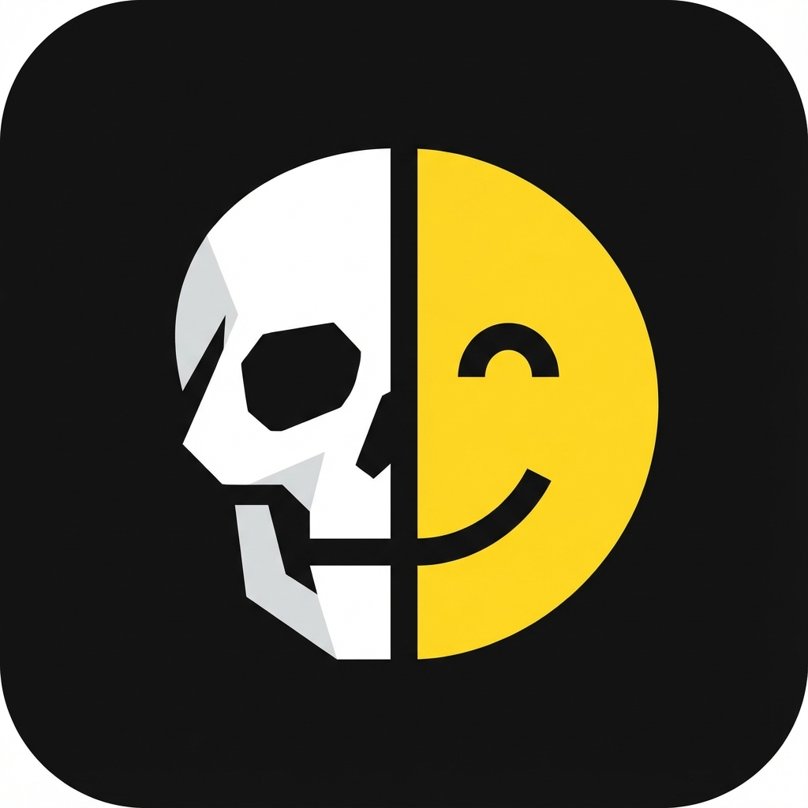

# 💀 Mort ou Vivant ?

Un jeu de quiz morbide et addictif où vous devez deviner si une célébrité est décédée ou toujours de ce monde.
Testez votre culture "nécrologique" !

<p align="center">
  
</p>

## 🎮 Comment jouer ?

1.  Une célébrité s'affiche.
2.  Cliquez sur **💀 MORT** ou **😊 VIVANT**.
3.  Gagnez des points pour chaque bonne réponse.
4.  Vous avez **3 vies**. Au bout de 3 erreurs, c'est perdu !

## 🚀 Fonctionnalités

-   **Base de données étendue** : Plus de 130 personnalités.
-   **PWA (Progressive Web App)** : Installable sur mobile et fonctionne hors ligne.
-   **Interface Dark Mode** : Design sombre et épuré.
-   **Responsive** : Optimisé pour tous les écrans (Desktop, Mobile).

## 🛠️ Installation & Développement

Ce projet utilise [Vite](https://vitejs.dev/) et Vanilla JavaScript.

1.  Cloner le projet :
    ```bash
    git clone https://github.com/lucashamon/mort-ou-vivant.git
    cd mort-ou-vivant
    ```

2.  Installer les dépendances :
    ```bash
    npm install
    ```

3.  Lancer le serveur de développement :
    ```bash
    npm run dev
    ```

4.  Construire pour la production :
    ```bash
    npm run build
    ```

## 📄 Structure du projet

-   `src/game.js` : Logique du jeu.
-   `main.js` : Gestion de l'interface (DOM).
-   `data.json` : Base de données des célébrités.
-   `public/` : Fichiers statiques et configuration PWA.

## 🤝 Contribuer

Les contributions sont les bienvenues ! N'hésitez pas à proposer de nouvelles célébrités dans `data.json`.
